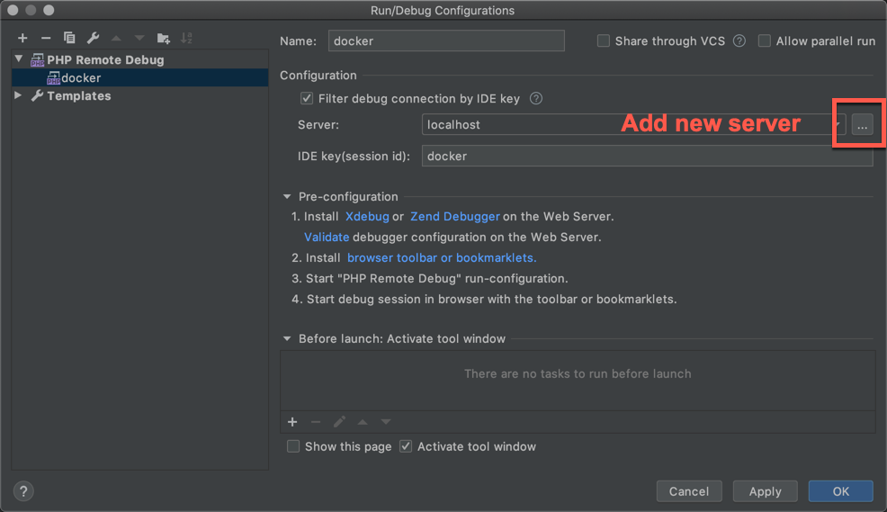
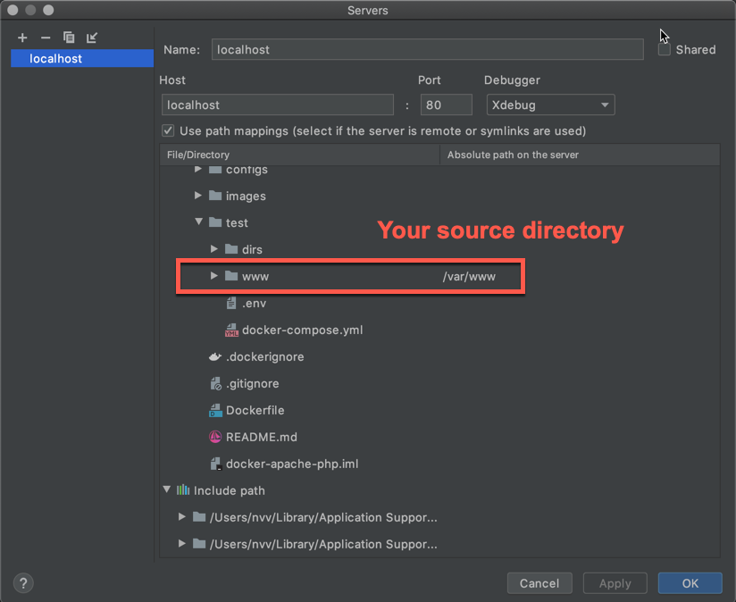
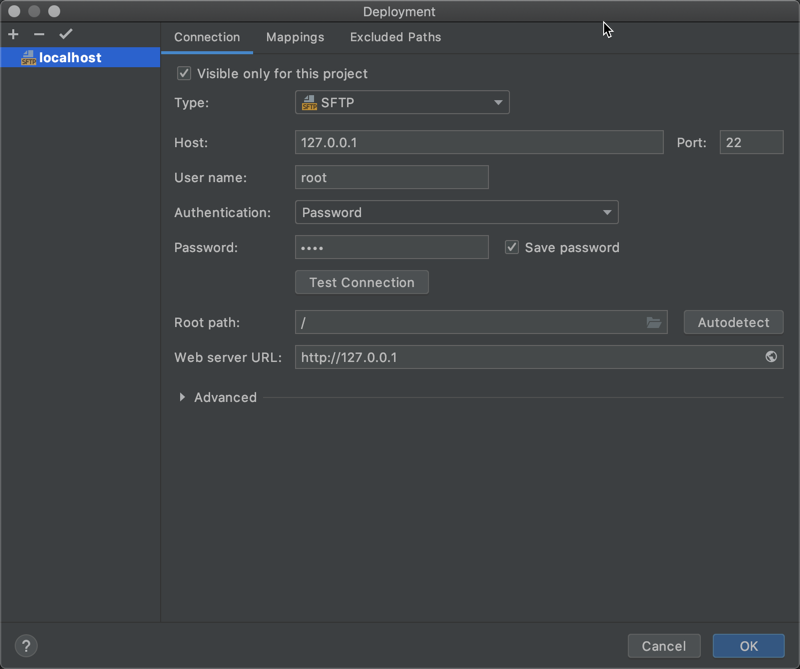

This is Apache + PHP 8.5 Docker Image (based on `php:8.5.10-apache-bookworm`)

## Installed packages:

- nodejs 24
- yarn
- grunt
- gulp
- composer
- git
- wget
- imagemagick
- msmtp
- unzip
- mc
- openssh-server
- gnupg
- poppler-utils
- ghostscript
- jpegoptim
- optipng
- pngquant
- gifsicle
- curl
- mariadb-client (mysql, mysqldump)
- cron

## Installed PHP libraries:

- bcmath
- curl
- exif
- gd (freetype, jpeg, webp)
- iconv
- intl
- json
- ldap
- mbstring
- mcrypt
- memcached
- mysqli
- opcache (built into PHP since 8.5)
- pcntl
- pdo_mysql
- pdo_pgsql
- simplexml
- soap
- tokenizer
- xdebug
- xml
- xsl
- zip

## XDebug

- XDebug is turned **off** by default
- **_Only_** for Windows - open port `9001` in firewall (or public network for Idea)
- **_Only_** for Linux - you need to alias your local IP: `sudo ifconfig en0 10.254.254.254 netmask 255.255.255.0 up`
- **_Only_** for MAC OS - you need to alias your local IP: `sudo ifconfig en0 alias 10.254.254.254 255.255.255.0`
- Create `PHP Remote Debug` and set **Idea key** to `docker`

- Create **Server** and set directory mappings

- **_Note_** that the last Intellij Idea creates a connection on the first run. You just to accept a connection

## SSH connection

If it is necessary, there is a possibility to create ssh connection inside docker container:

    host: 127.0.0.1
    login: root
    pass: root

## Running commands inside the container

The container runs as `root` (required by sshd), Apache/PHP workers run as `www-data` (UID 1000).
Run composer/npm/yarn as `www-data` so created files are not owned by root:

    docker exec -it -u www-data <container> composer install

## Build commands

The image is built for `linux/amd64` (Linux / Intel) and `linux/arm64` (macOS Apple Silicon) under one tag.

Create a builder (once):

    docker buildx create --name multi --use
    docker buildx inspect --bootstrap

Build and push:

    docker buildx build --platform linux/amd64,linux/arm64 -t vnemchenko/php8-apache:latest --push .

Verify:

    docker buildx imagetools inspect vnemchenko/php8-apache:latest

## Full docker-compose configuration

      application:
        image: vnemchenko/php8-apache
        volumes:
          - ${PATH_TO_SOURCE_DIRECTORY}:/var/www
          - ${PATH_TO_DOCKER_CONFIGS}/custom.ini:/usr/local/etc/php/conf.d/custom.ini
          - ${PATH_TO_DOCKER_CONFIGS}/xdebug.ini:/usr/local/etc/php/conf.d/xdebug.ini
          - ${PATH_TO_DOCKER_CONFIGS}/opcache.ini:/usr/local/etc/php/conf.d/opcache.ini
          - ${PATH_TO_DOCKER_CONFIGS}/apache2.conf:/etc/apache2/apache2.conf
          - ${PATH_TO_DOCKER_CONFIGS}/virtualhost.conf:/etc/apache2/sites-enabled/virtualhost.conf
          - ${PATH_TO_DOCKER_CONFIGS}/msmtprc:/etc/msmtprc
          - ${PATH_TO_TMP_DIRECTORIES}:/tmp/php
          - ${PATH_TO_LOG_DIRECTORIES}:/tmp/logs
        ports:
          - ${YOUR_HTTP_PORT}:80
          - ${YOUR_HTTPS_PORT}:443
          - ${YOUR_SSH_PORT}:22
          
## Minimal docker-compose configuration

      application:
        image: vnemchenko/php8-apache
        volumes:
          - ${PATH_TO_SOURCE_DIRECTORY}:/var/www
        ports:
          - ${YOUR_HTTP_PORT}:80

## Generate SSL certificate
        openssl req -new -newkey rsa:4096 -days 3650 -nodes -x509 -subj "/C=UA/ST=Cherkasy/L=Cherkasy/O=306/CN=dev" -addext "subjectAltName=DNS:dev,DNS:localhost,IP:127.0.0.1" -addext "basicConstraints=critical,CA:FALSE" -keyout /tmp/php/ssl.key -out /tmp/php/ssl.crt
